# Lab 1: Serverless ETL and Data Discovery using Amazon Glue

* [Introduction](#introduction)
* [Architectural Diagram](#architectural-diagram)
* [Create an IAM Role](#create-an-iam-role)
* [Create an Amazon S3 bucket](#create-an-amazon-s3-bucket)
* [Discover the Data](#discover-the-data)
* [Optimize the Queries and convert into Parquet](#optimize-the-queries-and-convert-into-parquet)
* [Query the Partitioned Data using Amazon Athena](#query-the-partitioned-data-using-amazon-athena)
* [Summary](#summary)

## Introduction
Recall that we have a huge dataset of trip records from Yellow and Green taxis in NYC from 2009 to 2016 as well as For-Hire Vehicles from 2015 to 2016. You received these data from various sources and know nothing about the structure, columns and counts of records.

In this lab, we will be using AWS Glue to perform data discovery and analyzing a dataset without starting and setting up a single server.

## Architectural Diagram
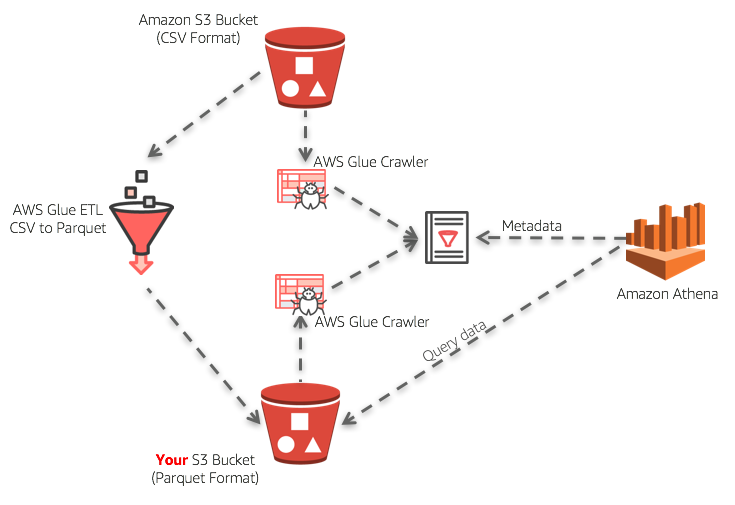

## Create an IAM Role

Create an IAM role that has permission to your Amazon S3 sources, targets, temporary directory, scripts, **AWSGlueServiceRole** and any libraries used by the job. You can click [here](https://console.aws.amazon.com/iam/home?region=ap-southeast-1#/roles) to create a new role. For additional documentation to create a role [here](docs.aws.amazon.com/cli/latest/reference/iam/create-role.html).

1. On the IAM Page, click on **Create Role**.
2. Choose the service as **Glue** and click on **Next: Permissions** on the bottom.
3. On the Attach permissions policies, search policies for S3 and check the box for **AmazonS3FullAccess**.

  > Do not click on the policy, you just have to check the corresponding checkbox.

  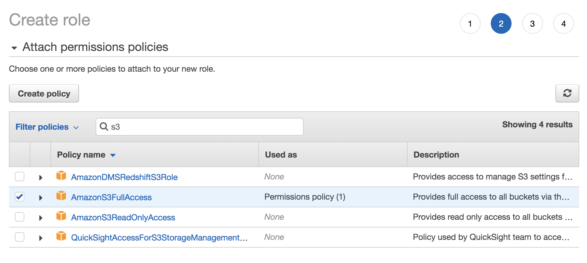

4. After you have checked the box, on the same page, now enter search for "Glue" and check the box for **AWSGlueServiceRole** and **AWSGlueConsoleFullAccess**.

  > Do not click on the policy, you just have to check the corresponding checkbox.

  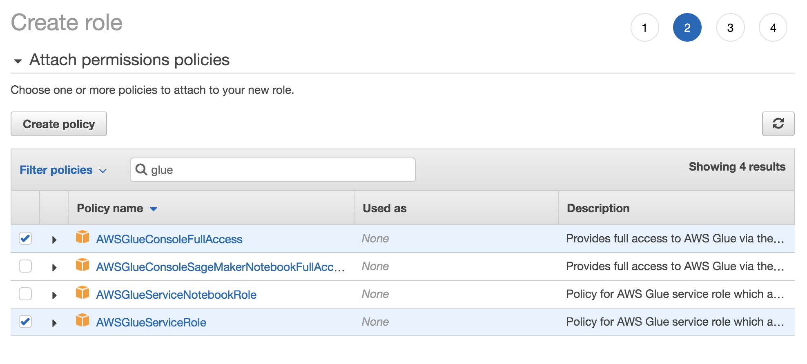

5. Click on **Next: Tags**. You can enter any tags for this role as you wish.
6. Click on **Next: Review**.
7. Enter Role name as

  ```
  nycitytaxianalysis
  ```
  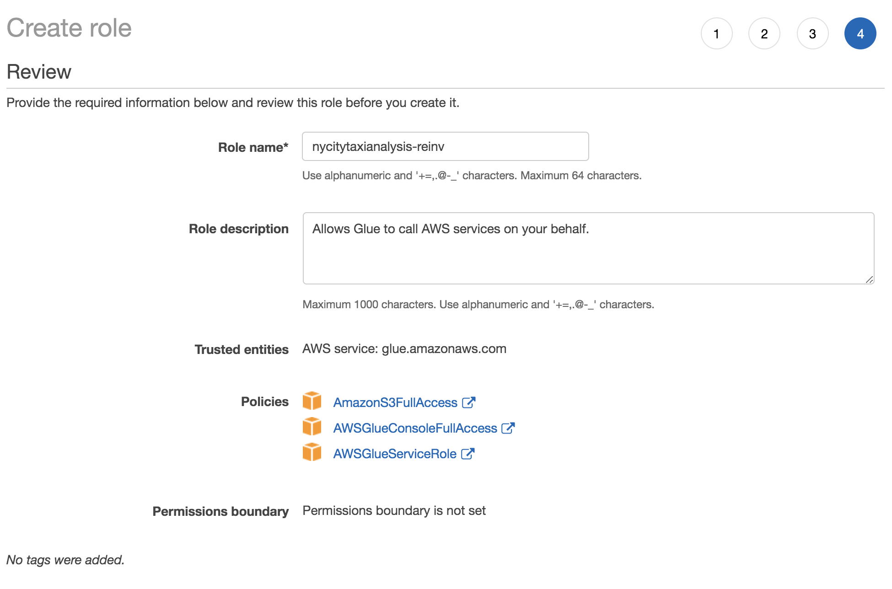
8. Check that there should be 3 Policies listed.
9. Click **Create Role**.

## Create an Amazon S3 bucket

1. Open the [AWS Management console for Amazon S3](https://s3.console.aws.amazon.com/s3/home?region=ap-southeast-1)
2. On the S3 Dashboard, Click on **Create Bucket**.

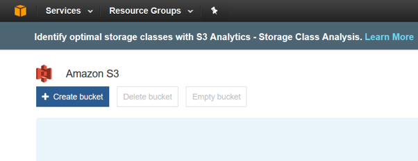

1. In the **Create Bucket** pop-up page, input a unique **Bucket name**. So it’s advised to choose a large bucket name, with many random characters and numbers (no spaces). It will be easier to name your bucket

   ```
   aws-glue-scripts-msd-workshop<100>-ap-southeast-1
   ```
   and it would be easier to choose/select this bucket for the remainder of this Lab.

   1. Select the region as **Asia Pacific (Singapore)**.
   2. Click **Create** to create (on the left bottom) your bucket with all the default settings.

   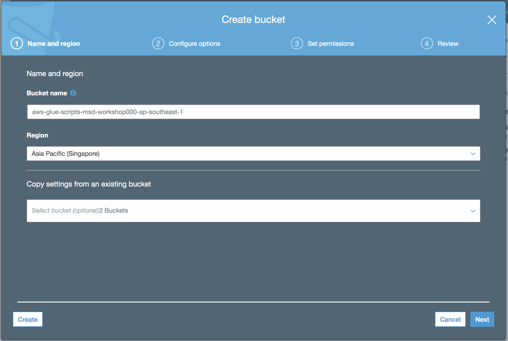

2. Now, in this newly created bucket, create two sub-buckets **tmp** and **target** using the same instructions as the above step. We will use these buckets as part of the lab later on.

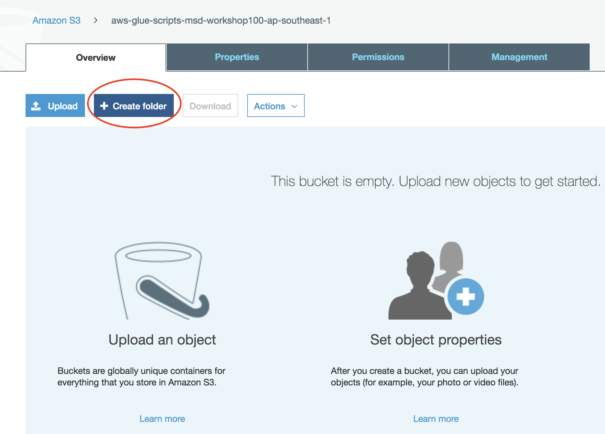

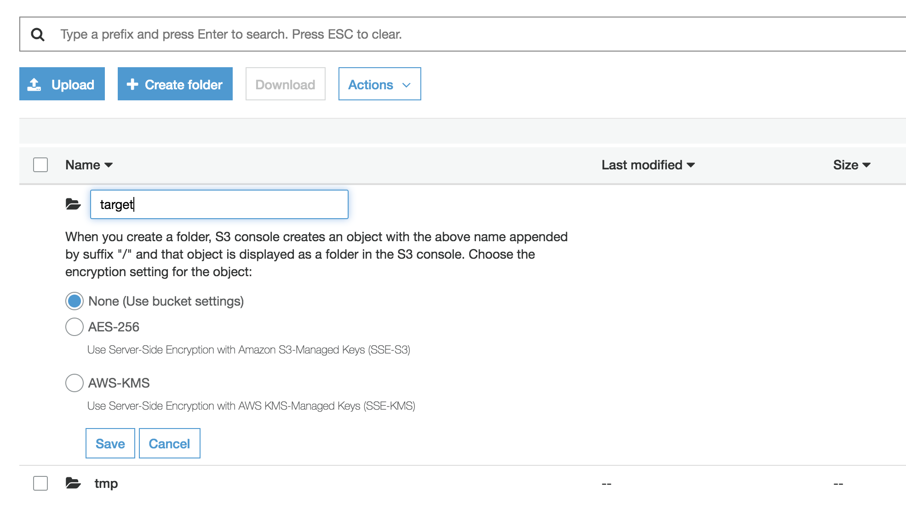

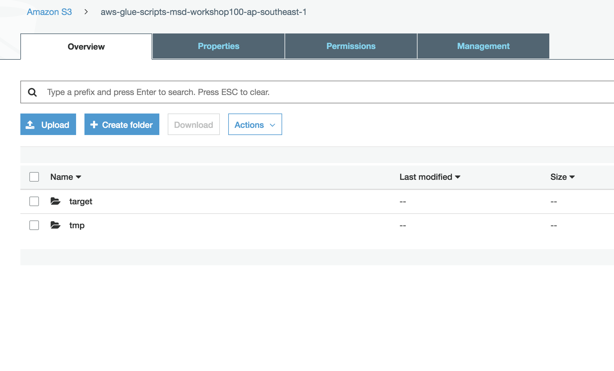

## Discover the Data

During this workshop, we will focus on **one month** of the New York City Taxi Records dataset, however you could easily do this for the entire eight years of data.

As you crawl this unknown dataset, you discover that the data is in different formats, depending on the type of taxi. You then convert the data to a canonical form, start to analyze it, and build a set of visualizations. All without launching a single server.

> For this lab, you will need to choose the **Asia Pacific (Singapore)** region.

1. Open the [AWS Management console for Amazon Glue](https://ap-southeast-1.console.aws.amazon.com/glue/home?region=ap-southeast-1#).

2. To analyze all the taxi rides for January 2016, you start with a set of data in S3. First, create a database for this workshop within AWS Glue. A database is a set of associated table definitions, organized into a logical group. In Athena, database names are all lowercase, no matter what you type.

   i. Click on **Databases** under Data Catalog column on the left.

   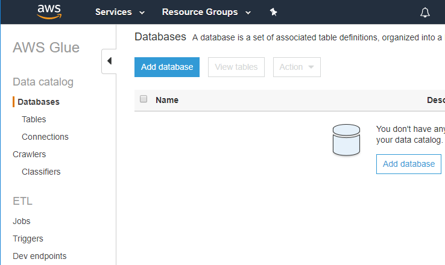

   ii. Click on the **Add Database** button.

   iii. Enter the Database name as **nycitytaxianalysis**. You can skip the description and location fields and click on **Create**.

3. Click on **Crawlers** under Data Catalog column on the left.

   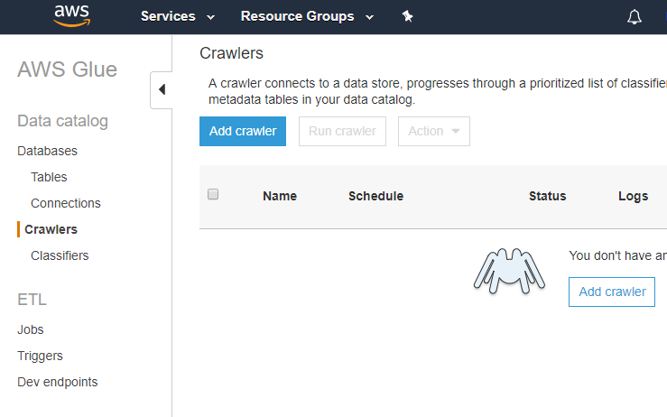

   i. Click on **Add Crawler** button.

   ii. Under Add information about your crawler, for Crawler name type **nycitytaxianalysis-crawler**. You can skip the Description and Classifiers field and click on **Next**.

   iii. Under Data Store, choose S3. And Ensure the radio button for **Crawl Data in Specified path in another account** is checked.

   iv. For Include path, enter the following S3 path and click on **Next**.

   ```
   s3://serverless-analytics/glue-blog
   ```

   v. For *Add Another data store*, choose **No** and click on **Next**.

   vi. For *Choose an IAM Role*, select **Create an IAM role** and enter the role name as following and click on **Next**.

   ```
   nycitytaxianalysis-crawler
   ```

   vii. For Create a schedule for this crawler, choose Frequency as **Run on Demand** and click on **Next**.

   viii. Configure the crawler output database and prefix:

   ​	a. For **Database**, select the database created earlier, **nycitytaxianalysis**.

   ​	b. Review configuration and click on **Finish** and on the next page, click on **Run it now** in the green box on the top.

   

   ​	c. The crawler runs and indicates that it found three tables.

4. Click on **Tables**, under Data Catalog on the left column.

5. If you look under **Tables**, you can see the three new tables that were created under the database nycitytaxianalysis.

   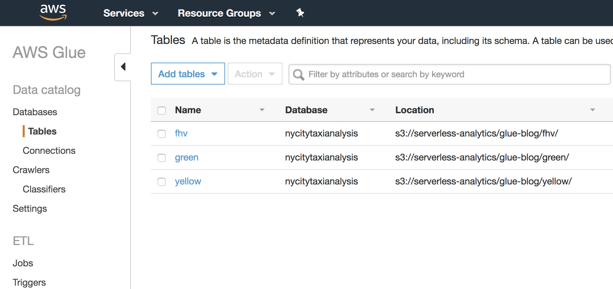

6. The crawler used the built-in classifiers and identified the tables as CSV, inferred the columns/data types, and collected a set of properties for each table. If you look in each of those table definitions, you see the number of rows for each dataset found and that the columns don’t match between tables. As an example, clicking on the *yellow* table, you can see the yellow dataset for January 2017 with 8.7 million rows, the location on S3, and the various columns found.

   

## Optimize the Queries and convert into Parquet

Create an ETL job to move this data into a query-optimized form. You convert the data into a column format, changing the storage type to Parquet, and writing the data to a bucket that you own.

1. Open the [AWS Management console for Amazon Glue](https://ap-southeast-1.console.aws.amazon.com/glue/home?region=ap-southeast-1#).

2. Click on **Jobs** under ETL on the left column and then click on the **Add Job** button.

3. Under Job properties, input name as **nycitytaxianalysis-yellow**. Since we will be working with only the yellow dataset for this workshop.

   i. Under IAM Role, Choose the IAM role created at the beginning of this lab.

   x. Under This job runs, choose the radio button for **A proposed script generated by AWS Glue**.

   xi. For Script file name, enter **nycitytaxianalysis-yellow**.

   > For this workshop, we are only working on the yellow dataset. Feel free to run through these steps to also convert the green and FHV dataset as well.

   xii. For S3 path where script is stored, click on the Folder icon and choose the S3 bucket created at the beginning of this workshop. **Choose the newly created S3 bucket via the Folder icon**.

   xiii. For Temporary directory, choose the tmp folder created at the beginning of this workshop. **Choose the S3 bucket via the Folder icon** and click **Next**.

   > Ensure the temporary bucket is already created/available in your S3 bucket.

   

   xiv. Click on Advanced properties, and select **Enable** for Job bookmark.

   xv. Here's a screenshot of a finished job properties window:

   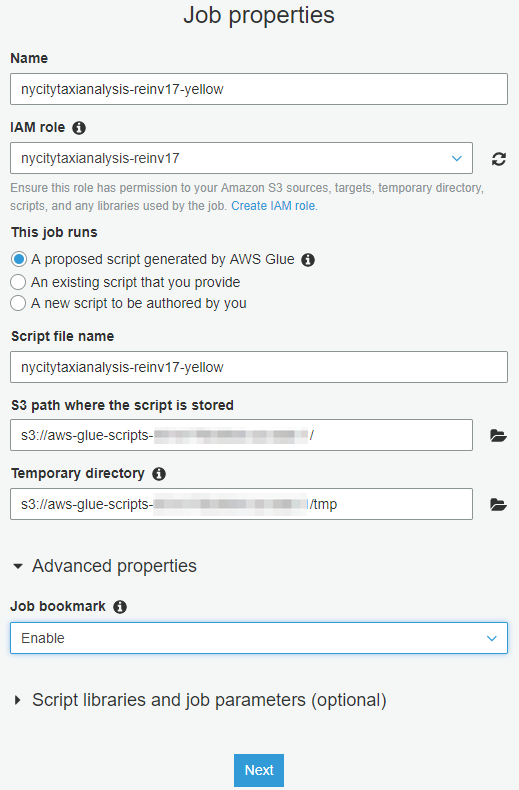

4. Click **Next**.

5. Under Choose your data sources, select **yellow** table as the data source and click on **Next**.

   > For this workshop, we are only working on the yellow dataset. Feel free to run through these steps to also convert the green and FHV dataset.

6. Under Choose your data targets, select the radio button for **Create tables in your data target**.

   i. For Data store, Choose **Amazon S3**.

   ii. For Format, choose **Parquet**.

   iii. For Target path, **click on the folder icon** and choose the *target* folder previously created. **This S3 Bucket/Folder will contain the transformed Parquet data**.

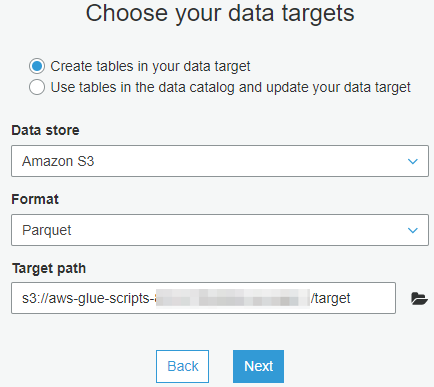

7. Under Map the source columns to target columns page,

   i. Under Target, change the Column name **tpep_pickup_datetime** to **pickup_date**. Click on its respective **data type** field string and change the Column type to **TIMESTAMP** and click on **Update**.

   ii. Under Target, change the Column name **tpep_dropoff_datetime** to **dropoff_date**. Click on its respective **data type** field string and change the Column type to **TIMESTAMP** and click on **Update**.

   iii. Verify the information and click **Save job and edit script**.

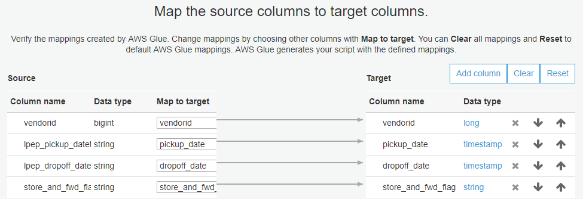

8. On the auto-generated script page, click on **Save** and **Run Job**.


8. In the parameters pop-up, for Job bookmark, ensure its **Enable** and click on **Run Job**.

9. Click on **Run Job** when you see the optional Parameters popup.

10. This job will run for roughly around 30 minutes.

   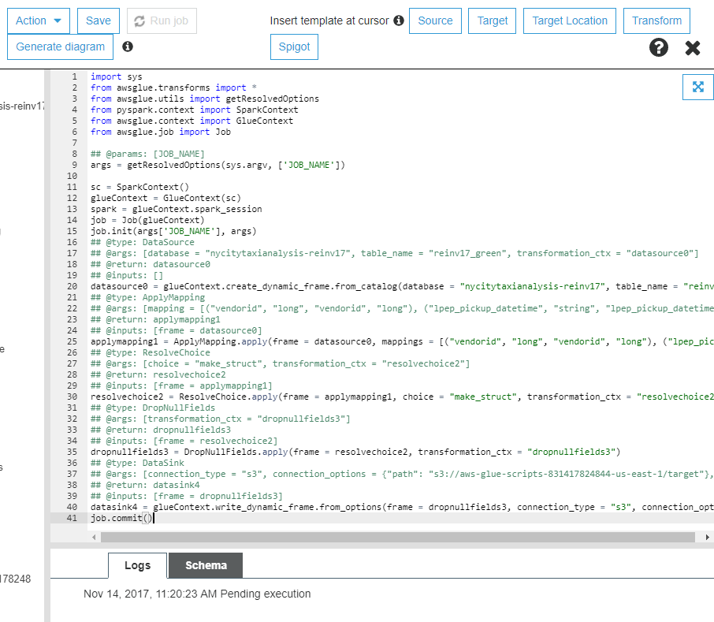

11. You can view logs at the bottom page of the same page.

  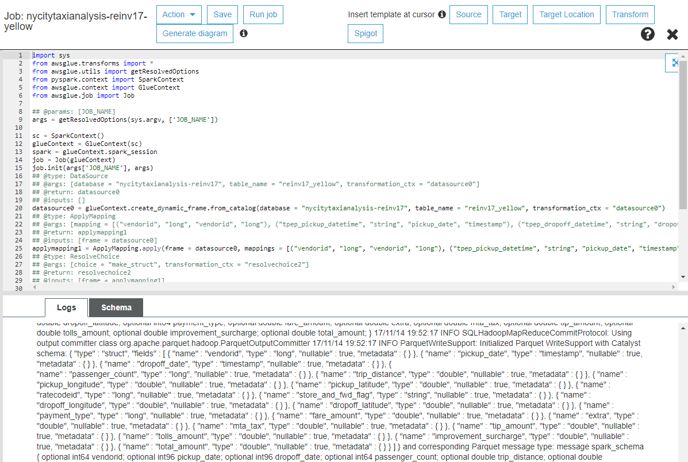

12. The target folder (S3 Bucket) specified above (step 6 iii) will now have the converted parquet data.

## Query the Partitioned Data using Amazon Athena

Athena uses the AWS Glue Data Catalog as a central location to store and retrieve table metadata throughout an AWS account. The Athena execution engine requires table metadata that instructs it where to read data, how to read it, and other information necessary to process the data. The AWS Glue Data Catalog provides a unified metadata repository across a variety of data sources and data formats, integrating not only with Athena, but with Amazon S3, Amazon RDS, Amazon Redshift, Amazon Redshift Spectrum, Amazon EMR, and any application compatible with the Apache Hive metastore.

1. Open the [AWS Management console for Amazon Athena](https://ap-southeast-1.console.aws.amazon.com/athena/home?force&region=ap-southeast-1).

   > Ensure you are in the **Asia Pacific (Singapore)** region.

2. Under Database, you should see the database **nycitytaxianalysis** which was created during the previous section.

3. Click on **Create Table** right below the drop-down for Database and click on **Automatically (AWS Glue Crawler)**.

4. You will now be re-directed to the AWS Glue console to set up a crawler. The crawler connects to your data store and automatically determines its structure to create the metadata for your table. Click on **Continue**.

5. Enter Crawler name as **nycitytaxianalysis-crawlerparquet** and Click **Next**.

6. Select Data store as **S3**.

7. Choose Crawl data in **Specified path in my account**.

8. For Include path, click on the folder Icon and choose the **target** folder previously made which contains the parquet data and click on **Next**.

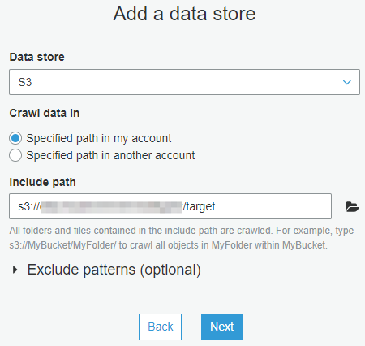

9. In Add another data store, choose **No** and click on **Next**.

10. For Choose an IAM role, select Choose an existing IAM role, and in the drop-down pick the role made in the previous section and click on **Next**.

11. In Create a schedule for this crawler, pick frequency as **Run on demand** and click on **Next**.

12. For Configure the crawler's output, Click **Add Database** and enter **nycitytaxianalysis-parquet** as the database name and click **create**. For Prefix added to tables, you can enter a prefix **parq_** and click **Next**.

13. Review the Crawler Info and click **Finish**. Click on **Run it Now?**.

14. Click on **Tables** on the left, and for database **nycitytaxianalysis-parquet** you should see the table **parq_target**. Click on the table name and you will see the MetaData for this converted table.

15. Open the [AWS Management console for Amazon Athena](https://ap-southeast-1.console.aws.amazon.com/athena/home?force&region=ap-southeast-1).

    > Ensure you are in the **Asia Pacific (Singapore)** region.

16. Under Database, you should see the database **nycitytaxianalysis-parquet** which was just created. Select this database and you should see under Tables **parq_target**.

17. In the query editor on the right, type

    ```sql
    select count(*) from parq_target;
    ```

    and take note the Run Time and Data scanned numbers here.

    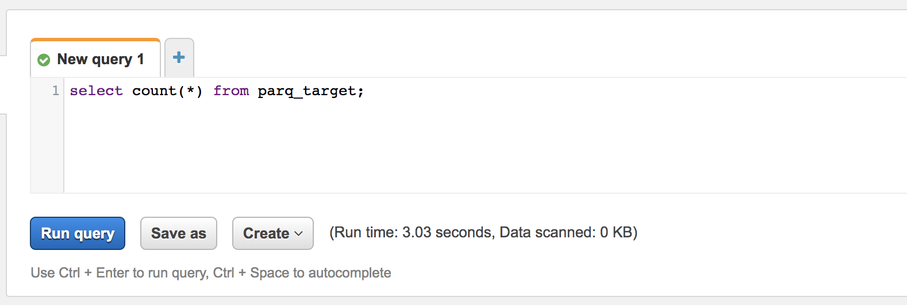

    What we see is the Run time and Data scanned numbers for Amazon Athena to **query and scan the parquet data**.

18. Under Database, you should see the earlier made database **nycitytaxianalysis** which was created in a previous section. Select this database and you should see under Tables **reinv17_yellow**.

19. In the query editor on the right, type

    ```
    select count(*) from yellow;
    ```

    and take note the Run Time and Data scanned numbers here.

    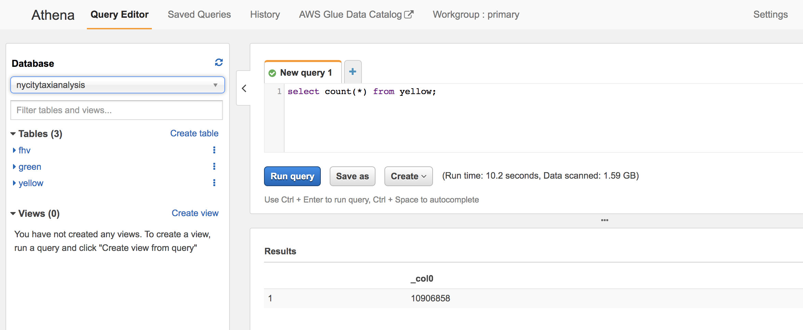

20. What we see is the Run time and Data scanned numbers for Amazon Athena to query and scan the uncompressed data from the previous section.


> Note: Athena charges you by the amount of data scanned per query. You can save on costs and get better performance if you partition the data, compress data, or convert it to columnar formats such as Apache Parquet.

## Summary

In this lab, you went from data discovery to analyzing a canonical dataset, without starting and setting up a single server. You started by crawling a dataset you didn’t know anything about and the crawler told you the structure, columns, and counts of records.

From there, you saw the datasets were in different formats, but represented the same thing: NY City Taxi rides. You then converted them into a canonical (or normalized) form that is easily queried through Athena and possible in QuickSight, in addition to a wide number of different tools not covered in this post.

In the next lab, we will look deeper at using Athena to query the data in S3. Continue to [Lab 2](../Lab2/README.md).
