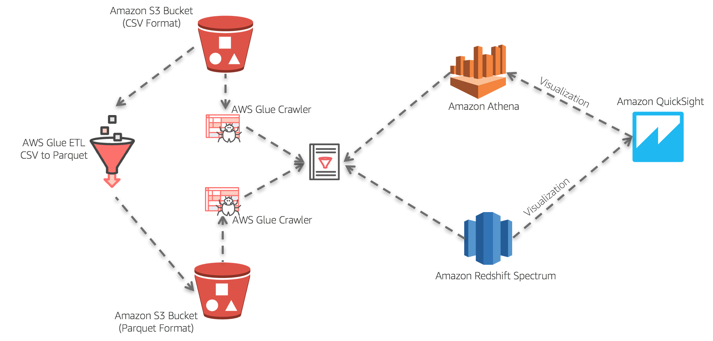

# Data Lake Design and Optimization on AWS

## Overview

In this lab, we are going to build a serverless architecture to analyze the data directly from Amazon S3 using [Amazon Athena](https://aws.amazon.com/athena/) and visualize the data in [Amazon QuickSight](https://quicksight.aws/).

The data set that we are going to use is a public data set that includes trip records from all trips completed in Yellow and Green taxis in New York City from 2009 to 2016, and all trips in for-hire vehicles (FHV) from 2015 to 2016.

Records include fields capturing pick-up and drop-off dates/times, pick-up and drop-off locations, trip distances, itemized fares, rate types, payment types, and driver-reported passenger counts.

The overall architecture is going to be something like this:

---

## Labs

|Lab|Name|
|---|----|
|Lab 1|[Serverless ETL and Data Discovery using Amazon Glue](Lab1/README.md)|
|Lab 2|[Analysis of data in Amazon S3 using Amazon Redshift Spectrum](Lab2/README.md)|
|Lab 3|[Serverless Analysis of data in Amazon S3 using Amazon Athena](Lab3/README.md)|
|Lab 4|[Visualization using Amazon QuickSight](Lab4/README.md)|

---

## **ADDITIONAL RESOURCES**

### Amazon Athena:

- <https://aws.amazon.com/blogs/big-data/top-10-performance-tuning-tips-for-amazon-athena/>
- <http://docs.aws.amazon.com/athena/latest/ug/convert-to-columnar.html>

### Redshift Spectrum
- https://aws.amazon.com/blogs/big-data/10-best-practices-for-amazon-redshift-spectrum/

### Serverless Analysis Architecture Blogs:
- <https://aws.amazon.com/blogs/big-data/derive-insights-from-iot-in-minutes-using-aws-iot-amazon-kinesis-firehose-amazon-athena-and-amazon-quicksight/>
- <https://aws.amazon.com/blogs/big-data/build-a-serverless-architecture-to-analyze-amazon-cloudfront-access-logs-using-aws-lambda-amazon-athena-and-amazon-kinesis-analytics/>
